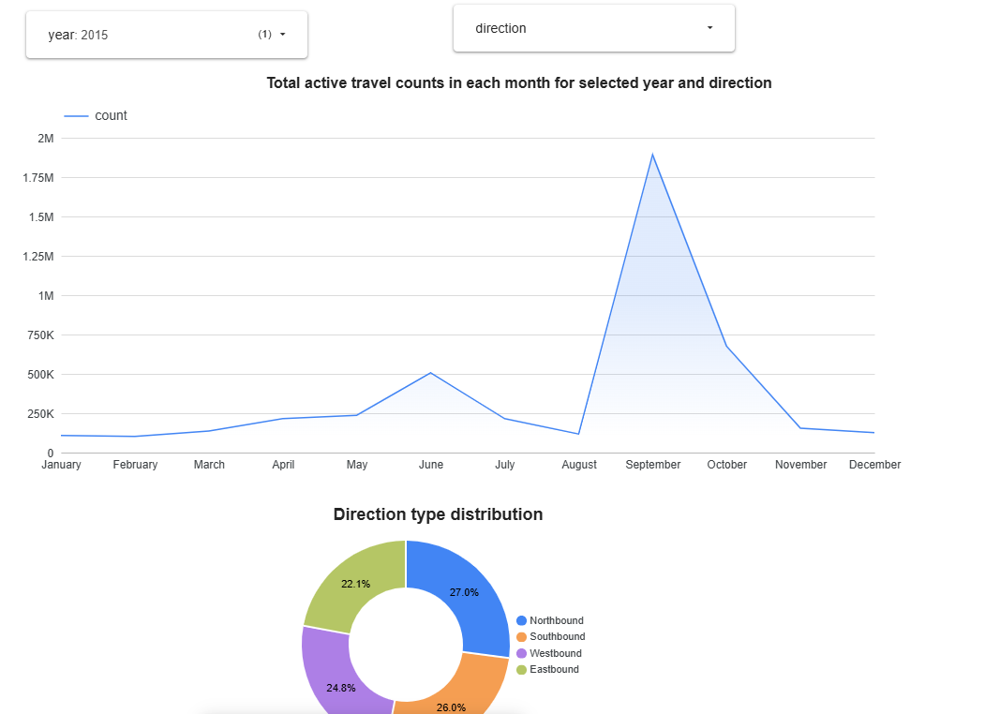

# Santander bicycle rentals analytics

## Problem description
This project is focused on processing data and building Data Warehouse in Google BigQuery from the dataset Santander bicycle rentals in London. 

Airflow is used to fetch and process raw data from dataset and upload the files to gcp bucket and create the tables in staging phase.

DBT is used to process the uploaded data and create the DWH in BigQuery from uploaded data.

Airflow will trigger the DBT Cloud Job every month.
## Data Pipeline
Current project uses Batch Streaming and Airflow used for orchestration.

## Transformations
Transformations happens 2 times in the project:
1. **Polars, Pandas**: Columns have inconsistent number of columns and names, so they neeed to be in 1 schema so table can be created from them without any problem
2. **DBT Cloud**: DBT Cloud takes the data from staging tables and creates the table. Cloud job will build the models and push the created tables in prod dataset.

## Technologies
1. **Cloud**: GCP
2. **Workflow orchestration**: Airflow
3. **Data Warehouse**: BigQuery
4. **Batch processing**: Polars, Pandas

## Dashboard
For visulisation, Looker Studio is used - here is the [Link](https://lookerstudio.google.com/reporting/45ebd5d9-2890-4b59-b6ec-0a33117ad953)

Dashboard has 2 graphs:
1. **First graph shows the monthly count of bike rental accross the 12 months**
2. **Second graph shows the distribution of bike rentals among directions**

Visualisation created for choosen year(s) and direction(s).

   

